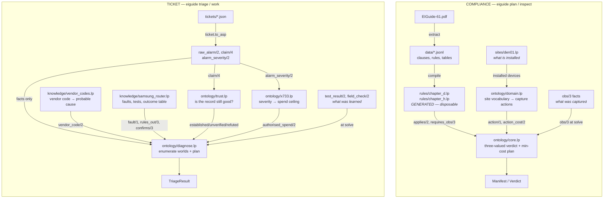
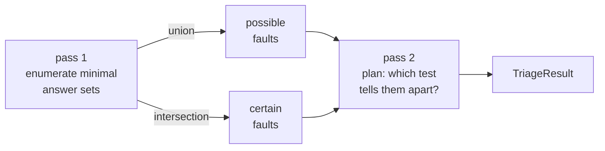

# DESIGN — the ontology

This repo solves two separate problems with two completely separate logic programs that share no code, no predicates, and no facts. **Understanding that split is the single most important thing.**

How each program is built: what each file is responsible for, what it may assume, what it hands upward, and how they compose.

Descriptive, not aspirational. Where something is missing it says so under
[Known gaps](#known-gaps) rather than being described as if it existed.

---

## The split

**`ontology/` contains two disjoint logic programs, not one.** They share no predicates, no
facts, and no files. Nothing in `core.lp` or `domain.lp` is visible to `diagnose.lp`, and
nothing in `trust.lp` or `x733.lp` is visible to `core.lp`.

| | compliance | ticket |
|---|---|---|
| **question** | which obligations are undischarged, and what is the cheapest way to settle them? | what is wrong, and what is the cheapest question that would tell us? |
| **ontology files** | `core.lp`, `domain.lp` | `trust.lp`, `x733.lp`, `diagnose.lp` |
| **knowledge** | `rules/chapter_*.lp` (generated) | `knowledge/*.lp` (hand-written) |
| **instance** | `sites/*.lp` | a ticket JSON, rendered by `ticket.to_asp()` |
| **entry point** | `reason.solve()` | `triage.solve()` |
| **CLI** | `plan`, `inspect`, `review`, `prove` | `triage`, `work` |

If you were looking for the place where they meet, there isn't one yet. That is
[gap 1](#1-the-two-sides-share-a-shape-not-a-layer).

---

## Both pipelines



Two rules govern the whole layout, and both are already enforced in the code:

- **Generated files never redefine hand-written predicates.** `rules/chapter_*.lp` references
  `cell/2`, `requires_obs/3`, `obs_kind/2` — and defines none of them. So re-running
  extraction against a new revision of the source document cannot disturb the domain model
  (`domain.lp:3`).
- **Instance files state what *is*, never what was *seen*.** `sites/den01.lp` describes what is
  installed; `obs/3` arrives separately at solve time. That separation is what lets the same
  site file produce a capture plan before any evidence exists and a verdict afterwards
  (`sites/den01.lp:3`).

---

## The split that actually matters

Every file divides into one of two kinds, and this is the most useful thing to know when
reading them:

| file | choice rules | `#minimize` | constraints | kind |
|---|---:|---:|---:|---|
| `domain.lp` | 0 | 0 | 0 | **derivation** |
| `trust.lp` | 0 | 0 | 0 | **derivation** |
| `x733.lp` | 0 | 0 | 0 | **derivation** |
| `core.lp` | 1 | 1 | 2 | **search** |
| `diagnose.lp` | 2 | 3 | 7 | **search** |

**Derivation files** are pure forward chaining. Facts in, facts out, one fixpoint, no
alternatives. You can read them top to bottom and simulate them in your head. Any production
rule engine — CLIPS, Drools, Experta — would run them unchanged.

**Search files** generate a solution space with a choice rule, then constrain it with integrity constraints, and
rank survivors with `#minimize`. There is no fixpoint to simulate: the meaning is *the set
of models that satisfy every constraint*, and that is why this is clingo and not a rules engine.
Set-cover optimisation and model enumeration are the two things RETE cannot do at all.

So: **derivation is portable, search is not.** The value is concentrated in `core.lp` and
`diagnose.lp`; the other three are cheap and could live anywhere.

---

## The two-pass protocol (ticket side)

This is the part that surprises people reading `triage.py` for the first time, and it exists for
a precise reason: *agreement is a property of the model set, and no single model can see it.*



Pass 1 asks: *what could be true?* The answer sets ARE the possibilities. Pass 2 asks: *what is the
cheapest question to tell these apart?* That requires seeing all survivors at once, which is a
property of the whole collection, not any single world. `candidate/1` and `certain/1` are `#defined`
(not derived) and injected as facts on pass 2.

---

## File reference

### `ontology/core.lp` — compliance verdict and plan

The idea the compliance side rests on: **under partial observation a requirement is not
binary.**

```prolog
undetermined(R, X) :- applies(R, X), not satisfied(R, X), not violated(R, X).
```

Closed-world reasoning would collapse this into "not violated" and report a site clean because
nobody looked at it. That failure mode is why this is not Datalog (`core.lp:42`).

| | |
|---|---|
| **assumes** | `applies/2`, `requires_obs/3`, `satisfied/2`, `violated/2` from generated rules; `obs/3` at solve time; `action/1`, `action_cost/2`, `action_covers/2`, `action_target/2` from `domain.lp` |
| **derives** | `captured/2`, `undetermined/2`, `gap/3`, `coverable/2`, `unreachable/3`, `covers/3`, `useful/1`, `closes/4` |
| **chooses** | `{ do(A) } :- action(A)` |
| **forbids** | a closable gap left unclosed; an action that closes nothing |
| **ranks** | `#minimize { C, A : do(A), action_cost(A, C) }` |

`closes/4` is worth singling out. It records exactly which requirement, on which subject, each
chosen action settles — derived *inside* the logic rather than reconstructed afterwards. This makes
the manifest's claims traceable to the reasoning that produced them, but only as accurately as the rule
itself is written. The rule is the ground truth; the derivation just records what it did.

### `ontology/domain.lp` — site vocabulary and action generation

Hand-written and stable across rule regeneration. Turns "what is installed" into "what could be captured, and at what
cost."

Actions are **derived, not enumerated**, in three tiers of increasing reach:

| tier | action | cost | settles |
|---|---|---:|---|
| 1 | `capture(X, O)` | 5 | one observation, one subject — the fallback that always exists |
| 2 | `survey(X, K)` | 6 | every marking of kind K on one subject, in one framing |
| 3 | `sweep(G, K)` | 10 | every marking of kind K on every member of a group |

Only *lookable* observations bundle — `bundleable(O) :- obs_kind(O, photo)` / `video`. A meter
reading happens per subject however things are grouped.

The optimizer in `core.lp` picks the combination, so the same rules give a different plan for a
2-cell string than a 24-cell one with nothing tuned by hand. `domain.lp:98` names this tier as
the reason a solver was used rather than a rules engine.

Groups are declared, not special-cased — a battery string and a cable rack are declared
identically, which was the test of whether the sweep machinery was general or fitted to the
first case (`domain.lp:60`).

### `ontology/trust.lp` — is the record still good?

A system of record is authoritative about what was *intended* and only approximately right
about what is *there*. So the same three-valued discipline is applied one level down, to the
facts themselves.

```
claim/4, field_check/2
    ↓
low_confidence  ·  stale  ·  contradicted        ← three reasons, then discarded
    ↓
suspect
    ↓
established  ·  unverified  ·  refuted
    ↓
needs_verification  :-  unverified(F), load_bearing(F).
```

`field_check/2` overrides any `claim/4` unconditionally — someone standing at the rack beats
any row about it.

> **Coupling to be aware of:** `needs_verification/1` depends on `load_bearing/1`, which is
> defined in `diagnose.lp`, not here. The lower layer reaches upward. It works because both are
> grounded together, but `trust.lp` is not independently loadable, and the dependency is
> invisible from inside the file.

### `ontology/x733.lp` — what severity entitles you to spend

ITU-T X.733 perceived severity, ranked `cleared` < `indeterminate` < `warning` < `minor` <
`major` < `critical`. A ticket takes the severity of its worst live alarm.

The design claim is a boundary, and it is the whole reason the file is separable:

> Severity does not change *what is true*. It changes **what you are entitled to spend finding
> out.** A critical alarm does not make a fibre cut more likely; it only makes waiting to find
> out more expensive.

So severity enters the program at exactly one point — a ceiling on what a single probe may
cost — and nowhere else:

```prolog
:- do_test(T), test_cost(T, C), ticket(Tk), authorised_spend(Tk, Max), C > Max.
```

An alarm with no stated severity defaults to `indeterminate`, X.733's own default. Not "fine."

### `ontology/diagnose.lp` — the incident world

The largest file and the one carrying the current design. Its opening line is the encoding:

> An alarm creates an incident world. […] A **world** is one way things could be: a set of
> faults that accounts for what was reported, with nothing spare. The answer sets ARE the
> possibilities, so nothing here maintains a candidate list — evidence arrives as constraints,
> and worlds stop existing.

That is a real architectural commitment, and it replaced two things worth understanding because
their failure modes are instructive:

| replaced | why it failed |
|---|---|
| `candidate/1` + `eliminated/1` | a possibility set maintained by hand inside a single answer set. Only elimination could narrow it, so a reading that positively *confirmed* something changed nothing. |
| `solved :- open_candidates(1)` | forbade simultaneous faults by construction. A power event that takes out a node and its heartbeat is two faults, and a plant produces them routinely. |

**Generate:** `{ fault(H) : hypothesis(H) }` — a world is any set of faults.

**Constrain** — each integrity constraint is a way the world could *not* be:

```prolog
:- symptom(_, S), not explained(S).                        % must account for what was reported
:- fault(H), not needed(H).                                % and carry nothing spare
:- fault(H), test_result(T, V), rules_out(T, V, H).        % evidence removes worlds
:- fault(H), requires_fact(H, F), refuted(F).              % so does a refuted record
```

The "nothing spare" line is load-bearing, and measurably so: at 15 faults able to explain the
alarm, **32512 worlds without it, 8 with it** (`diagnose.lp:151`).

**Rank:** `#minimize { 1@3, H : fault(H) }` — Occam, at the highest priority. The smallest set
of faults that accounts for the symptoms wins, so a second fault appears only when no single one
explains what was seen. Cost of tests (`@2`) and count of verifications (`@1`) rank below it.


#### Two milestones, deliberately separate

```prolog
cause_known     :- certain(_), not action_disputed,
                   not any_provisional, not any_contested, not blind_spot.
service_restored :- cause_known, certain_action(R), restored(R).
```

You can identify a fiber cut in four minutes and be eight hours from restoring service.
Collapsing the two lets the system claim victory at the halfway point.

Note what `cause_known` is *not*: it is not "one explanation survives." Every surviving world
has to agree on the cause, whether that cause is one fault or two.

#### Never a bare negative

Five distinct `unsolved_reason/1` strings, so "not solved" always says which of these it is:
no world accounts for the alarms, the survivors call for different actions, an explanation rests
on an unverified record, an alarm code is unrecognised, or the evidence contradicts itself.

---

## The shape both sides share

They share no code, but they are the same idea twice, and noticing that is most of
understanding the repo:

| | compliance | ticket |
|---|---|---|
| third value | `undetermined/2` | `unverified/1`, `provisional/1` |
| never conclude from silence | a site nobody visited is not clean | a stale row is not a fact |
| surface the unreachable | `unreachable/3` | `indistinguishable/2` |
| plan = cheapest closure | `#minimize` over `do/1` | `#minimize` over `do_test/1` |
| derived provenance | `closes/4` | `disputed_by/3` |

Both refuse to let "we did not look" become "there is nothing there." That is the single
commitment the whole repo is built around.

---

## Known gaps

Carried forward from the superseded `DESIGN-solver.md`, restated against the current code. Its
§0 — the purely eliminative reasoner — is **closed**: `diagnose.lp` no longer maintains a
candidate list.

### 1. The two sides share a shape, not a layer

`obs(Subject, Obs, Value)` and `test_result(Test, Value)` are the same relation wearing
different names, and neither carries an id, a source, a timestamp, or a confidence. Evidence
enters both programs anonymous and unkeyed. A single evidence layer under both — `evidence/6`,
run through `trust.lp` rather than given a second trust mechanism — is the largest structural
change outstanding.

### 2. Nothing declares what addressed a reading

`requires_fact/2` says which *faults* depend on a record. Nothing says which *readings* did. An
optical power poll of "the uplink port" is a real reading of something real, but which thing
depends on a record being right — and when two sources contradict that record, every reading
through it should become provisional. Currently none do. See [VOCABULARY.md](VOCABULARY.md) on
`addressed_by`, and [INCIDENT.md](INCIDENT.md) §3 for the stronger claim that this forks the
world rather than weakening one row.

### 3. Costs are invented

`5/6/10` on the compliance side, `1/2/8/40` on the ticket side, `50/10/3/2` for spend ceilings.
All three sets are honest about being made up. What is defensible is *ordering* — remote before
on-site, reversible before destructive, logical before physical — and
[asprin](https://potassco.org/asprin/) expresses orderings as preference relations rather than
forcing them through one integer scale.

### 4. Nothing correlates alarms

One site power loss produces forty alarms. `SAMS-5120`'s two codes share a ticket only because
they arrived in one JSON file. Correlation is what would force `incident` to become a term the
program carries rather than an implicit singleton per solve.

### 5. Three trust reasons are derived and then discarded

`trust.lp` computes `low_confidence`, `stale`, and `contradicted` separately, collapses them into
`suspect`, and the UI then guesses — reporting a *contradicted* record as `"LOW CONFIDENCE"`
(`cli.py:627`). On `SAMS-5120` that label is measurably false: 90% confidence, 5 days old,
against an 80% threshold and a 90-day window.

### 6. No temporal ordering

`symptom/2` has no time in it, so the model cannot express that power telemetry went `ac_absent`
*before* the node went unreachable — the single most useful discriminator a NOC engineer has.
Ordering, not resolution: it needs sequence rather than seconds.

---

## Prior art

The design questions here have been asked before, in three distinct lineages. This is worth
knowing mostly because *"we chose X over Y, and here is why"* is a stronger design statement than
presenting an objective as invented from scratch.

> ⚠ Citations below are from recall and have **not been verified**. Check them before relying on
> the specifics.

**Model-based diagnosis** is the closest ancestor and the most useful.

- **Reiter, "A Theory of Diagnosis from First Principles"** (*Artificial Intelligence*, 1987).
  A diagnosis is a minimal hitting set of the conflict sets. Multi-fault falls out of the
  formalism rather than needing a separate objective — which is the same conclusion
  `diagnose.lp` reaches via minimal worlds under `#minimize { 1@3, H : fault(H) }`.
- **de Kleer & Williams, "Diagnosing Multiple Faults"** (*Artificial Intelligence*, 1987). GDE,
  and specifically **sequential diagnosis**: choosing the next measurement by expected
  information gain. Pass 2 here minimises plan cost subject to separating all survivors, which
  is a different and more conservative objective. Worth knowing as a deliberate choice.
- **de Kleer's ATMS** (assumption-based truth maintenance). Maintaining several contexts, each
  with its justifications, is exactly the "fork the world when an addressing fact is
  contradicted" idea in gap 2 — already formalised, decades ago.
- **Console & Torasso** characterised the spectrum between consistency-based and abductive
  diagnosis. The move this repo made in `diagnose.lp` is a named transition on that spectrum,
  not a novel fix.

**Telecom alarm systems**, which is gap 4 with a long history: Jakobson & Weissman's model-based
alarm correlation (IEEE Network, early 90s), and the **codebook approach** — Yemini, Kliger et
al. — which reduces correlation to decoding alarms against a codebook by minimum Hamming
distance, and became a commercial product. Earlier expert systems in this exact domain include
ACE (AT&T, cable maintenance from trouble reports), COMPASS (GTE, switch alarms), and MAX
(NYNEX, loop troubleshooting and dispatch decisions).

**Diagnosis in ASP specifically** is established — the DLV diagnosis frontend (Eiter, Faber,
Leone, Pfeifer) implements both consistency-based and abductive diagnosis in the answer-set
paradigm. And `asprin`, already cited in gap 3, is from the same group as clingo.

**Two cautionary tales** that argue for choices already made here:

- **MYCIN's certainty factors** were shown to be an ad-hoc calculus without a sound
  probabilistic reading. That is [VOCABULARY.md](VOCABULARY.md)'s opening argument — a vision
  model at 0.85 and a records database at 85 are not commensurable — reached independently.
- **XCON/R1** at DEC grew past 10,000 rules and became a maintenance problem more than a
  reasoning one. That is the argument for deriving relations rather than authoring them twice
  (`observes/2` was removed for exactly this reason) and for guardrails being structural.

---

## Reading order

If you are lost, read in this order — each file assumes only the ones above it.

1. **`sites/den01.lp`** — 40 lines of facts. What a site *is*.
2. **`ontology/core.lp`** — the three-valued verdict and the min-cost plan. The whole compliance
   idea in 89 lines.
3. **`ontology/domain.lp`** — how "what is installed" becomes "what could be captured."
4. **`rules/chapter_d.lp`** — generated output. Skim one rule; note it only *references* the
   vocabulary above.
5. **`knowledge/samsung_router.lp`** — the ticket side's knowledge, and effectively a decision
   table: test × outcome × fault × effect.
6. **`ontology/trust.lp`** — 69 lines, self-contained apart from `load_bearing/1`.
7. **`ontology/diagnose.lp`** — read the 30-line header comment first; it is the design argument,
   and the rest is that argument in ASP.

Companions: [VOCABULARY.md](VOCABULARY.md) (what evidence is, and the four questions to ask of
it) and [INCIDENT.md](INCIDENT.md) (what an incident is — note it was written against the
previous `candidate/eliminated` encoding and its §1 is superseded by the current file).
